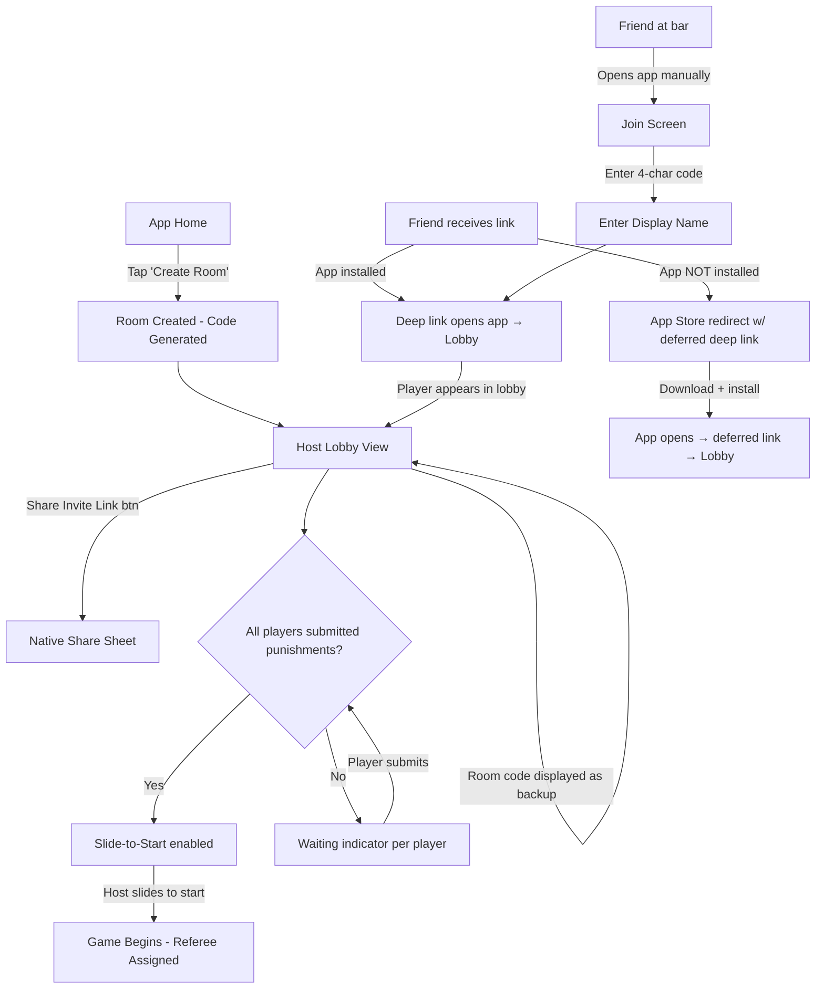
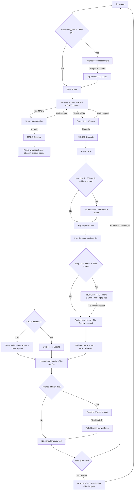
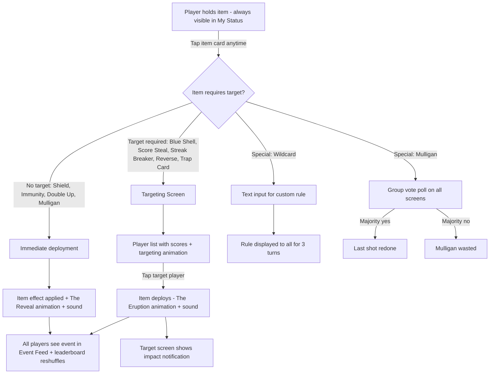
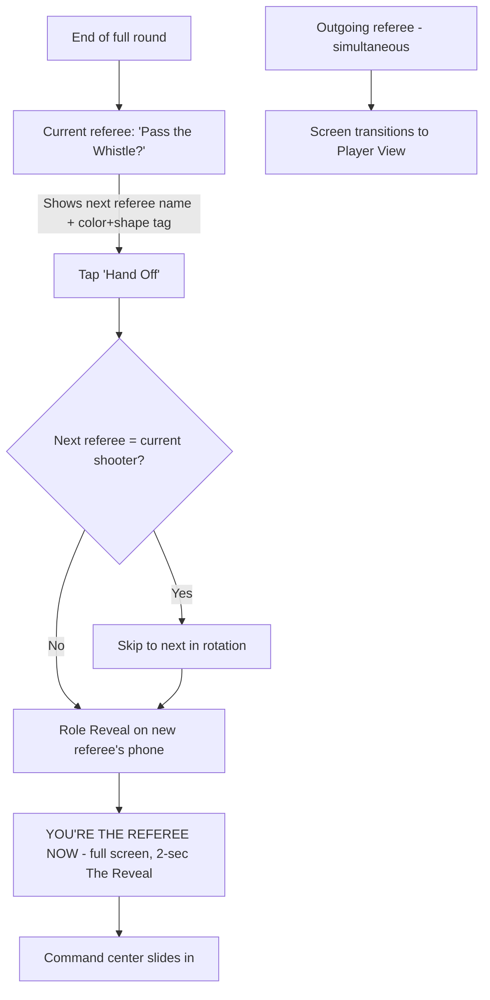
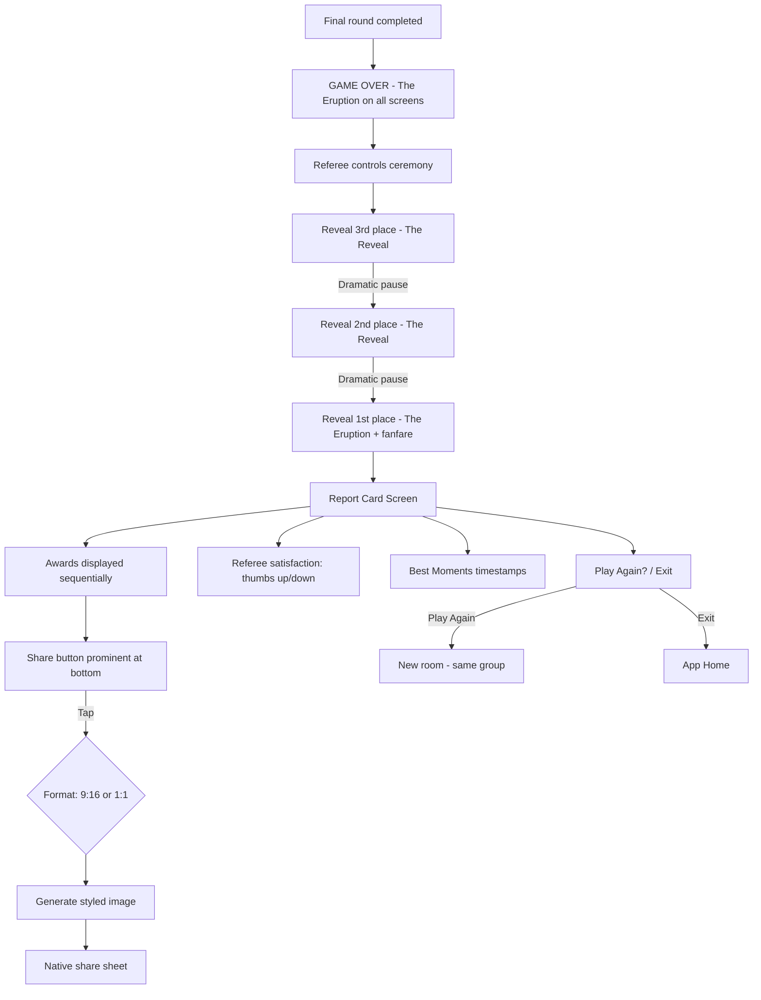

# UX Design Specification RackUp

**Author:** Ducdo
**Date:** 2026-03-21

---

## Executive Summary

### Project Vision

RackUp is a mobile-first party platform that layers structured, escalating chaos onto real bar games — starting with pool. Players join a room on their phones via a shareable code, play real pool at a real table, and the app orchestrates secret missions, Mario Kart-style items, escalating punishments, and a dramatic leaderboard on top. The core design principle: missing is fun, not failure. The app turns a forgettable Tuesday night into a story friends retell for weeks.

The product creates an entirely new category — the physical-digital party game bridge. No app exists that overlays digital party mechanics onto a real-world bar game in progress. RackUp is built for friend groups (ages 21-34) at bars, with champion-driven acquisition (one person downloads, everyone joins via code) and a viral loop powered by shareable post-game report cards.

### Target Users

**Jake (27) — The Social Organizer (Acquisition Target):** The person who texts "pool tonight?" every Thursday. He discovers, downloads, creates rooms, and evangelizes. The entire onboarding flow is designed for Jake's confidence — if creating a room feels clunky, he won't risk looking foolish in front of friends. Jake is the funnel; everything starts with him.

**Maya (24) — The Content Creator (Viral Loop):** Here for the moments, not the competition. She films punishments, screenshots report cards, posts to Instagram Stories. The share flow and report card design are built for Maya — she is RackUp's unpaid marketing department.

**Danny (29) — The Casual Competitor (Skill-Equalizing Proof):** Terrible at pool, has the best time. Collects items through misses, deploys Blue Shells against first place, wins through chaos. Danny validates that inverted skill design works — if he's having the most fun, the product is working.

**Lena (26) — The Reluctant Player (Litmus Test):** Got dragged here. Doesn't play pool. Takes the referee role, starts announcing turns like a WWE commentator, becomes the loudest person at the table. If RackUp converts Lena, it works for everyone.

**The Referee (Rotating Role):** Every player takes turns. The referee announces turns, confirms shots (MADE/MISSED), delivers secret missions, reads punishments aloud. Designed to feel like being handed a microphone, not a clipboard. The referee role eliminates spectators — even non-shooters are actively performing.

### Key Design Challenges

1. **Referee Screen as Entertainment, Not Administration:** The referee command center is the #1 design priority. It controls game flow, mission delivery, shot confirmation, punishment announcements, and streak declarations. The UX must feel like a stage — dramatic, fun, powerful — not like a scoring app. If the referee is bored, the whole table is bored.

2. **Bar-Hostile Environment:** Dim lighting, one-handed use (other hand holds a drink), loud ambient noise, crowded spaces, poor cell signal. Every tap target must be oversized. Text must be readable at arm's length. The 5-second undo for shot results exists specifically because fat fingers are inevitable. The entire UI must be "drunk-proof" — forgiving, high-contrast, impossible to misuse.

3. **Zero-Friction, Zero-Tutorial Onboarding:** No tutorial exists in MVP. The UI must be self-explanatory within 3 seconds of seeing any screen. Jake holds up his phone and says "trust me" — if anyone is confused, he loses face and the group disengages. Every screen must communicate its single purpose immediately.

4. **Emotional Pacing Through Visual Escalation:** The game has a deliberate dramatic arc: mild punishments → medium → spicy, warming up → ON FIRE → UNSTOPPABLE, regular points → triple-point finale. The visual design must amplify this arc — the app should feel increasingly intense as the game progresses. Color, animation speed, typography weight, and screen energy should all escalate with the game state.

5. **Pre-Game Lobby as Emotional Buy-In:** The punishment submission screen is the first interactive moment for every player — the conversion point from "I joined a room" to "I'm invested in this game." If someone stares at a blank text field and freezes, the energy dies before the game starts. The lobby needs scaffolding — placeholder examples, a "random" button, anonymized previews of submitted punishments building anticipation. The lobby isn't a waiting room; it's the pregame hype. Research shows party game apps live or die on the first 10 minutes of the first session.

6. **State Transitions as Performance Moments:** Every major state change — player becoming referee, game entering triple-points, Blue Shell deploying — is a potential dead-air moment if the transition feels like a screen swap. Each transition must be designed as a dramatic reveal, not a loading state. The referee handoff in particular should feel like being called on stage, not handed a clipboard.

### Design Opportunities

1. **The Leaderboard as Theater:** Position-shuffle animations after every shot, streak fire indicators, Blue Shell impact ripples. This is the communal screen everyone watches — the "did you see that?!" moment. Buttery smooth, dramatic animation here becomes RackUp's signature visual identity and the moment people pull out cameras.

2. **Share-First Report Card as the Organic Growth Engine:** The post-game report card (9:16 Instagram Stories + 1:1 general sharing) is seen by people who've never used the app. It is not just a feature — it is the entire organic growth engine. Flight Club's highlight reel is their #1 viral driver; the report card is RackUp's MVP equivalent. It must look premium, roast lovingly (Participant Trophy, Punching Bag), and make non-players curious enough to ask "what is this?" If one screen gets obsessive visual polish, it's this one. Every person who sees a shared report card is a potential new Jake.

3. **Sound as Physical-Digital Bridge:** Five essential sounds (Blue Shell impact, leaderboard shuffle, punishment reveal, streak fire, podium fanfare) aren't UI feedback — they're atmosphere that spills from the phone into the bar. The Blue Shell chime should make the next table look over. Sound bridges the gap between the digital screen and the physical social experience.

4. **Referee Role as Engagement Design Pattern:** The rotating referee is a novel UX pattern — it solves the spectator problem by giving non-shooters an active, performative role. The referee screen must be designed as a performance tool: big text to read aloud, dramatic reveals to build suspense, satisfying buttons that feel like pulling levers on a game show.

5. **Referee Handoff as Role Reveal:** The transition from player to referee shouldn't feel like switching apps — it should feel like being called on stage. A full-screen "YOU'RE THE REFEREE NOW" takeover with a dramatic animation before the command center slides in. Every state transition is a performance opportunity.

6. **"RECORD THIS" as Anticipation Builder:** Rather than alerting during the moment, fire the prompt 3-5 seconds before the spicy punishment or Blue Shell is revealed — giving Maya time to get her camera ready. Build anticipation without spoiling the surprise by alerting everyone except the target. The anticipation window is what lets people capture the moment instead of missing it.

## Core User Experience

### Defining Experience

RackUp's core experience is the **referee shot confirmation loop** — a single tap (MADE or MISSED) that triggers a cascade of consequences: points awarded or streak reset, item drops, punishment draws, mission completions, and leaderboard reshuffles. This loop repeats dozens of times per game and is the heartbeat of the entire product. Every system in RackUp — items, missions, punishments, streaks, the leaderboard — flows from this one binary input.

The defining experience is not pool itself — it's the **chaos that erupts after every shot.** The real game isn't happening on the pool table; it's happening on the phones. A missed shot in normal pool is dead air. A missed shot in RackUp is an item drop, a punishment reveal, a streak reset, and a leaderboard shuffle — four distinct moments of drama compressed into 10 seconds. The app transforms a single binary event (made/missed) into a multi-layered spectacle that keeps every person at the table engaged.

### Platform Strategy

**Mobile-first, portrait-locked, one-handed.** RackUp is a Flutter cross-platform app (iOS + Android) designed for the specific physical context of standing at a bar with a drink in one hand and a phone in the other. Every interaction is thumb-reachable in portrait orientation.

**Platform constraints that drive design:**
- **Portrait-locked** — no landscape, no rotation. One-handed bar use is non-negotiable.
- **<50MB app size** — people discover RackUp at the bar and download on cell data. Large downloads kill impulse adoption.
- **Screen wake lock** — 30-60 minute sessions mean the screen must never dim or lock mid-game.
- **No camera, GPS, Bluetooth, or contacts required** — internet access only. Minimal permissions reduce download friction.
- **Sound that cuts through bar noise** — 5 essential sound effects designed as atmosphere, not notifications. Must respect device silent mode.
- **App-required for MVP (Among Us model)** — all players download the app. Deep links (rackup.app/join/CODE) direct to App Store if not installed. Web join deferred to Phase 2 based on adoption data.
- **Deferred deep linking** — the deep link must preserve the room code through an App Store redirect, so post-install the app opens directly into the lobby without re-entering the code. This eliminates the highest-friction moment in the join flow.

**Bar environment as design constraint:**
- Dim lighting → high-contrast UI, large text
- Loud ambient noise → sound effects as accents (<2 seconds), not narration
- Poor cell signal → 60-second disconnection recovery, optimistic client updates, server reconciliation
- Crowded spaces → oversized tap targets, forgiving touch zones
- Drinks in hand → one-handed thumb-reach design, 5-second undo for fat-finger correction

### Effortless Interactions

**These interactions must feel like they require zero thought:**

1. **Joining a room** — Enter code, type a name, you're in. Under 3 seconds from code entry to appearing in the lobby. No account creation, no sign-in, no permissions. Jake says "join this," and 10 seconds later everyone is in. The lobby must be designed for **staggered arrivals as the default state** — players trickling in over 3-5 minutes, not appearing simultaneously. Each new player joining should feel like a mini-event (name sliding in, animation) to keep Jake's confidence up and build pregame energy during the wait.

2. **The MADE/MISSED tap** — Two massive buttons. Green and red. No ambiguity, no hesitation. The referee watches the real shot, taps the result, and the cascade begins. The 5-second undo window exists so this tap never causes anxiety — if you fat-finger it, you fix it instantly.

3. **Deploying an item** — One tap to use, one tap to target (if applicable). Danny sees his Blue Shell, taps it, picks Jake, chaos erupts. No menus, no confirmation dialogs, no "are you sure?" — the whole point is impulsive, dramatic action. The targeting step should have its own micro-drama — instead of a plain player list, show players with scores and a targeting animation. Danny isn't picking a name from a dropdown; he's *aiming* at someone. The targeting moment should feel predatory and fun.

4. **Sharing the report card** — One tap on the share button generates a styled image and opens the native share sheet. Maya doesn't navigate menus or crop screenshots — the app generates a share-ready, Instagram Stories-formatted image automatically.

5. **Referee rotation** — "Pass the whistle?" prompt appears, one tap to hand off, the next player's screen transforms. No settings, no configuration. The system handles rotation order, skip logic, and handoff automatically.

**What should happen automatically without user intervention:**
- Turn order management and advancement
- Item drop probability calculations and rubber banding
- Punishment tier escalation based on game progression percentage
- Streak tracking, fire indicators, and milestone announcements
- Leaderboard recalculation and position-shuffle animations
- Disconnected player detection, turn-skipping, and silent reconnection
- Triple-points activation in the final 3 rounds
- Group identity fingerprinting for analytics

### Critical Success Moments

**Make-or-break moments that determine whether RackUp lives or dies:**

1. **Room Creation + First Join (Jake's Moment of Truth):** Jake holds up his phone and says "everyone join this." If room creation fails, if the code doesn't work, if joining takes more than a few seconds — Jake looks foolish in front of his friends. He will never open the app again. Room creation must succeed >99% of the time. Join latency must be <3 seconds. This is the single most fragile moment in the entire product.

2. **The First Miss That's Fun (The Emotional Unlock):** The moment the group realizes missing is MORE entertaining than making the shot. A miss triggers an item drop, a punishment that makes everyone laugh, or a mission that adds drama. When Danny misses and the group erupts instead of the usual sympathetic silence — that's the moment RackUp proves its thesis. If the first few misses feel like normal pool (awkward, boring), the group disengages before the chaos layer kicks in.

3. **The First Blue Shell (The Story Moment):** The first time someone deploys a Blue Shell — targeting first place, stripping their points, forcing an off-handed shot — and the leaderboard shuffles with a dramatic animation. This is the moment the group realizes RackUp isn't a scoring app; it's Mario Kart at the pool table. If this moment doesn't land with impact (sound, animation, visual drama), the item system feels like a gimmick instead of the core mechanic.

4. **The Post-Game Report Card (The Viral Moment):** The game ends, the podium ceremony reveals 3rd → 2nd → 1st, and the report card drops with awards and roasts. This is Maya's moment. If the report card looks cheap, if the share button is buried, if the image format doesn't fit Instagram Stories — the viral loop breaks. This screen is seen by people who've never used the app. It must sell RackUp in a single glance.

5. **The "Same Time Next Week?" Text (The Retention Moment):** This doesn't happen in the app — it happens in the group chat on the way home. But the app creates the conditions for it: a memorable night, shareable content, and the feeling that next time could be even crazier. If the first night is forgettable, that text never gets sent. The entire game arc — escalation, chaos, ceremony — must build toward this off-app moment.

### Experience Principles

These principles guide every UX decision in RackUp:

1. **Every second is someone's moment.** Zero dead time. Whether you're shooting, refereeing, deploying items, receiving punishments, or watching the leaderboard shuffle — you always have something to do, react to, or anticipate. No spectators, ever.

2. **Chaos is choreographed.** The escalation arc (mild → spicy, warming up → UNSTOPPABLE, regular → triple points) isn't random — it's a deliberate emotional narrative with a beginning, rising action, climax, and resolution. The UX must amplify this arc, not flatten it.

3. **One tap, maximum drama.** Every interaction should be simple to perform but visually rich in consequence. Complexity lives in the system; simplicity lives in the interaction. "Effortless" doesn't mean invisible — it means the tap *resonates*.

4. **The bar is the design spec.** Dim, loud, crowded, one-handed, drinks everywhere, terrible WiFi. Every design decision must survive this environment. If it doesn't work at 11 PM in a basement bar, it doesn't ship.

5. **Missing is the feature.** The entire UX must celebrate bad play — item drops on misses, consolation mechanics, punishment-as-entertainment. The visual and emotional design must make misses feel like opportunities, not failures. The worst player should have the most fun.

6. **If it's not shareable, it didn't happen.** Every peak moment (Blue Shell, spicy punishment, streak break, podium ceremony) should look and sound like content worth capturing. The report card must be share-ready by design. The "RECORD THIS" prompt primes the group to document their own viral moments.

## Desired Emotional Response

### Primary Emotional Goals

RackUp's emotional design serves one overarching goal: **turn a forgettable bar night into a story your friends retell for weeks.** The app doesn't just facilitate fun — it manufactures memorable moments through deliberate emotional choreography. Every system (items, punishments, missions, streaks, the leaderboard) exists to trigger specific emotional peaks at specific moments.

Four primary emotional states define the RackUp experience:

1. **Anticipation & Mischief** — "Something chaotic is about to happen and I can't wait." The grin before the punchline. This emotion lives in the moments before action: holding a Blue Shell, waiting for the referee to reveal a punishment, seeing the "RECORD THIS" prompt fire. The UX must create suspense gaps — brief moments of tension before dramatic payoffs.

2. **Explosive Shared Joy** — "DID YOU SEE THAT?!" The whole-table eruption when the leaderboard flips, when someone gets a spicy punishment, when Danny nukes first place. This isn't quiet satisfaction — it's audible, physical, contagious. It's the emotion that makes the next table look over and ask what's going on. Sound effects, animations, and dramatic reveals exist to amplify this moment from a phone screen into a physical room.

3. **Belonging & Inside Jokes** — "This is OUR thing." The feeling that this night is unique to this specific group. Custom punishments are personal. Report card roasts are affectionate. The "Punching Bag" award is funny because it's Danny and everyone knows Danny. This emotion is what drives "same time next week?" — not the game mechanics, but the shared stories that become group lore.

4. **Triumphant Chaos** — "I can't believe that just happened." The feeling of glorious unfairness that everyone loves. Danny wins despite missing every shot. The last-place player deploys Reverse and jumps to first. The entire game narrative flips in the triple-points finale. This emotion validates RackUp's core thesis: the best stories come from chaos, not skill.

### Emotional Journey Mapping

The emotional arc across a full RackUp session is deliberately choreographed — not random chaos, but a narrative structure with rising action and climax:

**Pre-Game (Lobby & Punishment Submission):**
- **Curiosity → Investment** — "What is this?" becomes "This is going to be hilarious" as players submit custom punishments and see the roster fill up. The lobby transforms from skepticism to buy-in.

**Early Game (Rounds 1-30% — Mild Tier):**
- **Discovery → Delight** — First item drop on a miss. First mild punishment that gets a laugh. First secret mission whispered by the referee. Players are learning the systems, and each new mechanic is a small surprise. The emotional temperature is warm — fun, light, exploratory.

**Mid Game (Rounds 30-70% — Medium Tier):**
- **Engagement → Intensity** — Streaks build. Items accumulate. The leaderboard starts shifting dramatically. Medium punishments land harder. Players are no longer learning — they're strategizing, scheming, targeting. Mischief becomes the dominant emotion. "Who has a Blue Shell?" becomes the table's anxious question.

**Late Game (Final 30% — Spicy Tier + Triple Points):**
- **Intensity → Peak Chaos** — Spicy punishments drop. Triple points activate. Every shot matters 3x. Items deployed with maximum impact. The emotional temperature is at its peak — shouting, filming, standing on chairs. This is where the stories are born.

**Post-Game (Ceremony & Report Card):**
- **Peak Chaos → Triumphant Nostalgia** — The podium reveal (3rd → 2nd → 1st) channels the chaos into a structured climax. The report card transforms the night into a shareable artifact. Awards like "Participant Trophy" convert the evening into affectionate roasts. The emotion shifts from active chaos to warm, proud reminiscence — "that was incredible."

**Post-App (The Walk Home):**
- **Nostalgia → Anticipation** — The report card lives in the group chat. Maya's Instagram story generates comments from friends who weren't there. The emotion is now forward-looking: "when are we doing this again?" The app's job is done when this text gets sent.

### Micro-Emotions

**Critical micro-emotions to design for:**

| Moment | Target Emotion | Opposite to Avoid |
|--------|---------------|-------------------|
| Missing a shot | Opportunity ("ooh, what will I get?") | Embarrassment ("I suck at this") |
| Receiving a punishment | Theatrical dread / good sport energy | Genuine humiliation or discomfort |
| Being targeted by an item | Dramatic outrage ("HOW DARE YOU") | Real anger or resentment |
| Refereeing | Power and showmanship | Boredom or feeling like a chore |
| Watching the leaderboard | Suspense and collective attention | Indifference or distraction |
| Losing the game | "Best night ever" regardless of score | Competitive frustration |
| Seeing the report card | Pride in the shared experience | Disappointment in personal performance |
| Joining for the first time | Instant belonging ("I get this") | Confusion or feeling left out |

**The key emotional inversion:** In every other competitive game, losing feels bad. In RackUp, losing must feel *entertaining*. The worst player should leave saying "that was the most fun I've had in months." This inversion is RackUp's emotional signature and the hardest thing to get right — the entire item system, punishment design, and consolation mechanics exist to manufacture this feeling.

**Punishment reveal as theater:** The punishment reveal screen must frame everything as a performance — game show reveal energy, playful typography, "THE POOL GODS HAVE SPOKEN" framing above the punishment text. The visual language must depersonalize who wrote the custom punishment, presenting it as coming from the game, not from a specific player. This distinction is what keeps "text your ex" feeling like comedy rather than cruelty.

**Item drops as gifts, not pity:** Item drops for struggling players must feel like gifts from the pool gods, not consolation prizes. "The pool gods smile upon you" energy, not "consolation item received." The copy and animation on item drops determine whether rubber banding feels empowering or patronizing — same mechanic, completely different emotional impact.

### Design Implications

**Emotion → UX Design Mapping:**

1. **Anticipation & Mischief → Suspense Gaps.** Every dramatic moment needs a beat of anticipation before the reveal. The punishment shouldn't appear instantly — a 1-2 second "drawing..." animation builds tension. The Blue Shell shouldn't resolve immediately — a brief targeting animation lets the whole table hold its breath. These micro-delays transform notifications into *moments*.

2. **Explosive Shared Joy → Synchronized Spectacle.** When the leaderboard shuffles, it must shuffle on ALL phones simultaneously so the group reacts together. Sound effects must fire at the same moment across devices. The experience is communal — if different phones show different states, the group eruption fragments. Synchronized spectacle is a technical requirement driven by an emotional goal.

3. **Belonging & Inside Jokes → Personalization.** Custom punishments, player-specific awards, group stats on return visits — these create the feeling that this game is *theirs*. The report card uses player names, not generic labels. The awards reference specific in-game events. The UX must feel like it knows this group, not like a generic template.

4. **Triumphant Chaos → Inversion Celebration.** When the worst player benefits from chaos (item drops, Reverse, Score Steal), the UX must celebrate it overtly — special animations, louder sounds, bigger visual impact. The app should visually declare: "THIS IS THE BEST PART." The underdog moment must feel more dramatic than the skilled play moment.

5. **Avoiding Embarrassment → Celebratory Miss Design.** When a player misses, the screen should never show a "failure" state. Instead: item drop animation, punishment reveal with theatrical flair, consolation item with "nice try" energy. The visual language of a miss should feel like opening a present, not dropping the ball.

6. **Avoiding Confusion → Progressive Disclosure.** Don't show all systems at once. The first turn reveals the basic loop. Items appear when they're earned. Missions appear when they're assigned. The player learns by experiencing, not by reading. Each new system is a surprise, not a cognitive load.

7. **Escalation Through Copy and Color.** The referee screen text is a performance script, not UI copy. Three tiers of language (mild/medium/spicy voice) mapped to game progression percentage — "Danny missed" in the early game vs. "DANNY. HAS. FALLEN." in the spicy tier. Combined with background color temperature shifting from cool/dark (early) to hot/saturated (spicy) to incandescent (triple points), these two systems deliver emotional escalation at minimal engineering cost. The referee reads aloud — the words on the screen are the emotional product for everyone at the table.

### Emotional Design Principles

1. **Suspense before payoff.** Every dramatic moment gets a 1-2 second anticipation beat. Never instant, never delayed — just enough tension to make the payoff land.

2. **The room erupts together.** Synchronized state across all devices so the group reacts as one. A communal "DID YOU SEE THAT" beats six individual notifications.

3. **Losing is the show.** The UX must invest more visual energy in misses, punishments, and underdog moments than in skilled play. The chaos is the entertainment; the skill is just the setup.

4. **Every moment is personal.** Player names, custom punishments, group-specific references. The app should feel like it was built for this specific friend group, not for a generic user.

5. **Escalate through copy and color.** MVP escalation focuses on two dimensions: referee script copy intensity (three tiers of language mapped to game progression) and background color temperature (cool → hot → incandescent). One visual variable plus tiered language creates the feeling of rising intensity without requiring complex animation systems.

6. **No player leaves feeling invisible.** Every player, every game, regardless of skill or luck, must have at least one moment where the app makes them the center of positive attention. The mechanics provide this through items and missions — the UX must celebrate it when it happens. One bad individual experience in a group setting can prevent the entire group from returning.

## UX Pattern Analysis & Inspiration

### Inspiring Products Analysis

RackUp sits at the intersection of party gaming, real-time multiplayer, social sharing, and physical-digital bridging. Six products provide the most relevant UX lessons:

**Kahoot! — The Synchronized Spectacle Engine**
Kahoot's core loop (answer → result → leaderboard shuffle) is the direct template for RackUp's shot → result → leaderboard cycle. What Kahoot does brilliantly: it transforms a simple binary input (right/wrong) into a dramatic moment through timing, animation, and synchronized display across all devices. The 2-3 second leaderboard shuffle — where everyone in the room watches positions change simultaneously — creates communal reactions that no individual screen experience can replicate. Kahoot's streak system (answer streak bonuses with escalating visual indicators) maps directly to RackUp's streak fire system. The lesson: a simple mechanic becomes compelling when the *reveal* is theatrical.

**Among Us — Zero-Friction Social Rooms**
Among Us demonstrates how room codes + minimal onboarding + wildly variable skill levels can create a global phenomenon (650M+ downloads). Their lobby is social before the game even starts — players chat, customize, and build anticipation. The emergency meeting mechanic — a sudden disruption where everyone argues — is the emotional template for Blue Shell moments: normal flow → sudden chaos → group reaction → resolution. Among Us also proves that hidden information (impostor role) creates social drama that transcends the digital interface — people argue face-to-face, not through the app. RackUp's secret missions create a lighter version of this same dynamic.

**Mario Kart — The Rubber Banding Emotional Model**
Mario Kart is the definitive reference for RackUp's item system. The rubber banding philosophy (last place gets the best items) is borrowed directly. But the critical UX lesson is *how items feel*: using a Blue Shell feels empowering and mischievous; getting hit by one feels theatrical and dramatic, not genuinely unfair. Mario Kart achieves this through over-the-top animation and sound — the Blue Shell doesn't just subtract points, it *arrives* with spectacle. Players laugh when hit because the experience is designed as comedy, not punishment. RackUp's item deployment must replicate this exact emotional register: devastating in mechanics, hilarious in presentation.

**Jackbox Games — The Physical Room is the Real Screen**
Jackbox's key UX insight: the phone is an input device, not the primary experience. The real game happens in the living room — people watching each other's reactions, laughing at responses, building social energy that no screen can contain. For RackUp, each phone serves as both input (referee taps, item deployment) and display (leaderboard, items, missions) — but the *real* experience happens at the pool table. This means the phone UX should be designed to facilitate table-level moments, not replace them. Text on the referee screen is meant to be read aloud. Animations on the leaderboard are meant to be watched together. The app is a catalyst, not a destination.

**Instagram Stories — The Share Target Format**
Instagram Stories defines the visual language RackUp's report card must speak. The 9:16 format, the 2-second attention window, the "swipe up for more" curiosity trigger — the report card must communicate "this was a fun game night" in a single glance. Instagram teaches that shareable content must be visually self-explanatory: someone scrolling Stories at 2 AM should understand the report card without context. Player names, awards with personality (Participant Trophy, Punching Bag), and a bold visual identity that reads as "party game" not "sports stats." The report card is RackUp's ambassador to people who've never heard of it.

**Flight Club Darts — The Real-World Precedent**
Flight Club is the closest real-world precedent for what RackUp is building — they took traditional darts and "supercharged it for the 21st century" with technology-enhanced multiplayer games, generating £80.4M in revenue. Their UX lessons are the most directly transferable: how they handle turn-taking displays, how the session escalates across rounds, how the auto-compiled highlight reel becomes viral content (consumers share it on social media, "essentially providing free advertisement"). The difference is delivery method — Flight Club requires multi-million-pound venue hardware; RackUp delivers the same emotional design through phones only. RackUp democratizes Flight Club's model: same experience architecture, software-only delivery, any bar with a pool table.

### Transferable UX Patterns

**Navigation & Flow Patterns:**

- **Invite link as primary join method (Jackbox/Among Us adapted):** Big "Share Invite" button as the primary action for Jake — he pastes a link in the group chat, not reads a code aloud at a noisy bar. The room code is displayed as a secondary fallback for when links don't work. Deep links with deferred routing preserve the room code through App Store install, so post-download the app opens directly into the lobby. Most apps do it backwards (big code, small share button) — RackUp flips the hierarchy.
- **Linear game flow with no back navigation:** During a game, there's no "back" button, no settings menu, no navigation stack. The game moves forward through states: lobby → punishment submission → game rounds → ceremony → report card. Each state transitions automatically. This mirrors Kahoot's flow — once a quiz starts, you're on rails until it ends.
- **State-based screen transformation:** The phone's screen changes based on your current role (player vs. referee) and game state (your turn vs. watching vs. deploying item). This is Among Us's pattern — your screen shows different information based on whether you're crew or impostor, alive or dead. No tab navigation, no menus — the app *becomes* what you need in the moment.

**Interaction Patterns:**

- **Binary input with cascading consequences (Kahoot):** One tap (MADE/MISSED) triggers a chain of results. The input is dead simple; the output is dramatic. This pattern keeps cognitive load near zero while maximizing visual and emotional output.
- **Targeting with social awareness (Mario Kart):** Item targeting shows who you're about to hit. In Mario Kart, you see the Blue Shell leave your hands and track toward first place. In RackUp, the targeting animation should show Danny selecting Jake — building a moment of anticipation for both the attacker and the target.
- **Inventory with constraint (Mario Kart):** One item slot, use-it-or-lose-it. Mario Kart's item box forces immediate strategic decisions — hold or deploy? RackUp's single-item inventory creates the same tension without any UI complexity. No inventory management screens, no crafting, no menus.

**Visual & Emotional Patterns:**

- **Leaderboard as entertainment (Kahoot):** The leaderboard isn't a static ranking — it's an animated spectacle with position shuffles, sound effects, and dramatic reveals. Kahoot proved that a leaderboard can be the most exciting part of the experience when treated as theater rather than data display.
- **Streak visualization escalation (Kahoot/Duolingo):** Visual indicators that intensify with consecutive success — warming up, ON FIRE, UNSTOPPABLE. Duolingo's streak freeze and Kahoot's answer streak both prove that streak visualization drives behavior and creates emotional investment.
- **Share-optimized output (Instagram Stories):** Designed-for-sharing content that looks native on social platforms. The report card must feel like it belongs in an Instagram Story — not like a screenshot of an app, but like a purpose-built piece of social content.
- **Highlight reel as viral engine (Flight Club):** Flight Club's auto-compiled highlight reel is their #1 viral driver — consumers share it as "free advertisement." RackUp's MVP equivalent is the report card with Best Moments timestamps; the Phase 2 vision is full video compilation.

### Anti-Patterns to Avoid

1. **The Settings Graveyard (Most apps):** Burying important options in nested settings menus. RackUp has minimal configuration (game length: 5/10/15 rounds) and it happens in the lobby, not in settings. No settings screen in MVP — if it's important enough to configure, it's important enough to surface in the flow.

2. **Tutorial Walls (Most mobile games):** Forcing users through a tutorial before they can play. RackUp's target users are standing at a bar with friends waiting. A tutorial is a death sentence. The game teaches itself through progressive disclosure — each mechanic reveals itself naturally during play. Marcus figured it out in one round in the user journey.

3. **Notification Permission on Install (Most apps):** Asking for push notification permission before the user has experienced value. RackUp defers this entirely from MVP and will request it after the first completed game in Phase 1.5 — when the user has context for why they'd want to hear from the app again.

4. **Complex Onboarding Flows (League apps like DigitalPool):** Account creation, email verification, profile setup, league selection before you can do anything. RackUp's competitors require all of this. RackUp requires a display name and a room code. Period.

5. **Information Overload Dashboards (Sports/stats apps):** Showing all data at once — scores, stats, history, achievements, settings. RackUp shows exactly one thing per screen state. Player view shows the leaderboard and your item. Referee view shows the current shooter and action buttons. Report card shows awards and share button. One purpose per screen, zero clutter.

6. **Silent Item/Reward Systems (Generic mobile games):** Receiving items or rewards with minimal fanfare — a small popup, a +1 indicator, a badge. RackUp's items must arrive with drama (animation + sound), be displayed with personality (item name + visual), and deploy with spectacle (targeting animation + impact effect). A silent Blue Shell is a notification; a dramatic Blue Shell is a *moment*.

7. **Confirmation Dialogs on Fun Actions (Enterprise UX leaking into games):** "Are you sure you want to use Blue Shell on Jake?" No. The whole point is impulsive chaos. Confirmation dialogs kill spontaneity. The 5-second undo on shot results is the only safety net — and it exists for errors, not for second-guessing. **One exception:** Start Game requires deliberate input (slide-to-start or hold-to-start). Accidental game start before all players have joined is catastrophic and irreversible — this is the one moment that deserves intentional friction to protect the session.

### Design Inspiration Strategy

**What to Adopt Directly:**

- **Invite link as primary join flow** (Jackbox/Among Us) — big "Share Invite" button for Jake, room code as secondary fallback. Deep link with deferred routing through App Store install. Proven, universal, zero-friction.
- **Binary input → cascading consequences** (Kahoot) — MADE/MISSED tap as the core interaction loop. Maximum output from minimum input.
- **Leaderboard as animated theater** (Kahoot) — position shuffles with sound and motion. The leaderboard is entertainment, not data.
- **Single-item inventory** (Mario Kart) — one slot, use-it-or-lose-it. Zero inventory management complexity.
- **9:16 share-optimized output** (Instagram Stories) — report card designed as social content, not app screenshot.
- **Session escalation arc** (Flight Club) — deliberate intensity build across the session, culminating in peak moments designed for sharing.

**What to Adapt for RackUp's Unique Context:**

- **Kahoot's synchronized reveal → RackUp's bar-scale spectacle.** Kahoot works on a classroom projector; RackUp works across 2-8 individual phones held by people standing around a pool table. The synchronization must account for variable network latency in bar environments and still feel simultaneous.
- **Mario Kart's item targeting → RackUp's social targeting.** In Mario Kart, targeting is automated (Blue Shell finds first place). In RackUp, targeting is manual and social — Danny picks Jake while looking him in the eye. The targeting UI must enhance this face-to-face social moment, not abstract it behind a screen.
- **Among Us's lobby socialization → RackUp's punishment submission.** Among Us's lobby lets players customize and chat. RackUp's lobby has players submitting custom punishments — this IS the socialization. The submission flow must feel collaborative and fun, with scaffolding (examples, random button) for people who freeze up.
- **Jackbox's phone-as-input → RackUp's phone-as-dual-device.** Jackbox phones are pure input (answers, drawings). RackUp phones are both input (referee taps) AND shared display (leaderboard everyone glances at). The UX must serve both roles without either interfering with the other.
- **Flight Club's venue hardware → RackUp's phone-only delivery.** Flight Club's turn-taking displays, scoring animations, and highlight reels run on dedicated venue screens. RackUp must deliver equivalent emotional impact on a 6-inch phone screen held in one hand. The constraint forces design discipline — every element must earn its screen space.

**What to Avoid from These Products:**

- **Kahoot's education framing** — RackUp is a party, not a classroom. No "learning objectives," no "progress reports," no teacher/student hierarchy.
- **Among Us's text chat** — In a bar, people talk face-to-face. In-app chat would pull attention from the table to the screen. All communication happens verbally through the referee.
- **Mario Kart's AI/single-player mode** — RackUp only works with real people physically together. No AI players, no solo practice, no single-player. The physical presence requirement is the product, not a limitation.
- **Jackbox's screen requirement** — Jackbox needs a shared TV/monitor. RackUp needs only phones. Don't introduce any shared-screen dependency.
- **Flight Club's venue dependency** — The whole point is that RackUp works at any bar. No venue hardware, no special equipment, no partnerships required for the core experience.

## Design System Foundation

### Design System Choice

**Fully Custom Design System** — RackUp's visual identity is built from scratch using Flutter's raw widget primitives for all visible UI, with Material's invisible infrastructure (TextField, Scaffold internals, scrolling) handling structural plumbing underneath. "Fully custom" means visually custom — every screen looks and feels like RackUp, not like a skinned Google app. The design system defines a custom color palette, typography, spacing system, animation language, and RackUp-specific component patterns — all purpose-built for the bar environment and party energy.

### Rationale for Selection

1. **Brand differentiation is the product.** RackUp creates a new category — it can't look like a reskinned Material app. The report card is seen by people who've never used the app; it must look premium and distinctive. The leaderboard, referee screen, and item system are the emotional core — they need to feel like a game show, not a utility.

2. **No existing design system captures "party chaos at a bar."** Material Design is productivity. Cupertino is refinement. Neither communicates "this is about to get wild." RackUp's visual language needs to be bold, high-contrast, escalating, and theatrical — a custom system lets every design decision serve that identity.

3. **The share target demands visual distinctiveness.** When Maya posts the report card to Instagram Stories, it competes with every other piece of content in the feed. A report card that looks like a generic app screenshot gets scrolled past. A report card with a distinctive, ownable visual identity — like Spotify Wrapped — stops the scroll.

### Implementation Approach

**Tiered Custom Design Strategy — focus custom energy where it creates the most value:**

**Tier 1 — Fully Custom Design (the screens that ARE the product):**
These screens define RackUp's identity and deserve maximum design investment:
- Referee command center (the #1 design priority — the energy engine)
- Leaderboard with position-shuffle animations (the communal spectacle)
- Post-game report card + share image generation (the viral growth engine)
- Item deployment + targeting UI (the chaos mechanic)
- Punishment and mission reveal screens (the theatrical moments)
- Streak fire indicators and milestone celebrations
- Pre-game lobby with staggered arrival animations and punishment submission

**Tier 2 — Simple Custom (functional, on-brand, not elaborate):**
These screens serve important functions but aren't the emotional core:
- Room creation screen
- Join-by-code / join-by-link screen
- Game configuration (round count selection)
- Post-game podium ceremony controls

**Tier 3 — Minimal Custom (works and matches the palette):**
These screens just need to function and not break the visual identity:
- App home/landing screen
- Error states and recovery prompts
- Connection status indicators
- Disconnection/reconnection UI

**Build approach:** All visible UI built from Flutter's raw widget primitives (Container, Stack, AnimatedBuilder, CustomPainter, GestureDetector). Material's invisible infrastructure (TextField for code/name input, Scaffold for layout structure, scrolling physics) used where reinventing would waste engineering time. This gives a fully custom look without rebuilding basic plumbing from scratch.

**Implementation note:** This UX spec's Design System section is the **source of truth** for all visual decisions. The architecture phase should translate these design tokens into a Flutter constants file (colors, spacing, font sizes, animation timings) to prevent spec-to-code drift. The UX spec is only valuable if it gets built faithfully.

**North star, not sprint 1 checklist:** The full design system materializes across the walking skeleton build stages. Stage 1 (weeks 1-3) implements basics — functional screens, correct colors, readable text. Stage 3 (weeks 7-9, the experience layer) implements the full animation language, escalation palette, report card templates, and polished component design.

### Customization Strategy

**Design Tokens — the foundation of the custom system:**

**Color System:**

- **Base canvas:** `#0F0E1A` — deep dark with a slight purple undertone. One value, every screen, no drift. Not pure black — the purple undertone feels more premium, is easier on the eyes in dark bars, and gives the escalation palette a warm starting point to shift from. Dark theme only — no light mode. Bars are dark; the screen should feel like a stage light, not a flashlight.

- **Escalation palette — 4 discrete color stops** mapped to game tiers (not a continuous gradient — discrete shifts are noticeable *moments*; a continuous gradient is invisible effort):
  1. **Lobby/Pre-game** — deep navy/dark purple (calm, anticipation)
  2. **Mild tier (0-30%)** — cool blues/teals (discovery, warming up)
  3. **Medium tier (30-70%)** — warm ambers/oranges (intensity building)
  4. **Spicy tier + Triple Points (70-100%)** — hot reds/magentas with gold accents (peak chaos)

  Implementation: a single `RackUpGameTheme` class that takes game progression percentage and returns the active color set. ~20 lines of code drives the entire visual escalation. When the tier changes, Flutter's reactive framework rebuilds every widget automatically.

- **Semantic colors (constant regardless of escalation state):** Green (MADE/success), Red (MISSED/danger), Gold (streak/achievement), Blue (items/power), Purple (missions/secret).

**Typography:**

Source: **Google Fonts** — zero licensing headaches for both in-app use and generated share images. No custom typeface needed; the right free font applied with conviction has all the energy RackUp requires.

- **Bold condensed display font** (Anton, Bebas Neue, Oswald, or Barlow Condensed) for player names, scores, and announcements — readable at arm's length in a dark bar. No thin weights, no serif fonts, no small text.
- **Referee script font** — same family, slightly larger size. Designed for reading aloud. The referee's phone is a teleprompter; text must be scannable in a glance.
- **Report card display font** — distinctive application of the chosen typeface. This is where font styling becomes brand identity — bold, condensed, recognizable in an Instagram Story feed.

**Spacing & Sizing:**
- **Minimum tap target: 56x56dp** — larger than platform standard (48dp) to account for one-handed bar use and imprecise tapping.
- **Generous padding** — elements need breathing room for fat-finger forgiveness. No tight layouts, no small gaps between tappable elements.
- **Full-width buttons** for primary actions (MADE/MISSED, Deploy Item, Share) — edge-to-edge, impossible to miss.

**Animation Language — 3 core motion patterns:**

Every animated moment in RackUp maps to one of three defined patterns. This creates visual consistency without monotony and gives the solo dev a framework instead of inventing motion from scratch each time:

1. **The Reveal** — a quick anticipation beat (100-200ms pause/build) followed by a fast, punchy payoff (200-300ms). Rhythm: hold... BAM. Used for: punishment reveal, item drop, mission assignment, podium reveal, "RECORD THIS" prompt.

2. **The Shuffle** — a fluid, cascading motion where elements slide past each other with staggered timing. Rhythm: flow, flow, flow, settle. Used for: leaderboard position changes, player list reordering, lobby staggered arrivals.

3. **The Eruption** — an explosive outward burst from a focal point. Rhythm: BOOM, ripple, settle. Used for: Blue Shell impact, streak milestone (ON FIRE, UNSTOPPABLE), triple-points activation, game start.

**Brand Identity — The Diagonal Slash:**

A **signature diagonal slash motif** serves as RackUp's visual brand mark — echoing a pool cue striking a ball, creating dynamic energy in static compositions. Simple enough to become instantly recognizable:
- Used as dividing elements on the report card
- Background pattern on share images
- Subtle accent throughout the app UI
- Renders cleanly with Flutter's `CustomPainter` at any resolution

The goal: like Spotify Wrapped, the report card format becomes ownable — instantly recognizable in a social feed before reading a single word. Every shared report card is a mini-billboard.

**RackUp-Specific Components:**

- **The Big Binary Buttons** — the MADE (green) / MISSED (red) pair. Oversized, high-contrast, satisfying to tap. The signature interaction of the entire app.
- **Player Name Tags** — **color + geometric shape** combination for 8 distinct, accessible player identities (circle, square, triangle, diamond, star, hexagon, cross, pentagon). Redundant visual encoding works for colorblind users (8-10% of men in target demographic), in dark bar lighting, and on the report card. Used consistently across leaderboard, targeting, referee screen, and report card.
- **Item Cards** — visual representation of held items with icon, name, and one-tap deploy. Must communicate the item's effect at a glance without reading a description.
- **Streak Fire Indicator** — escalating visual treatment (warming up → ON FIRE → UNSTOPPABLE) attached to player entries on the leaderboard. Uses The Eruption animation pattern on milestone transitions. Immediately recognizable, no text required.
- **Punishment Tier Tags** — MILD / MEDIUM / SPICY visual badges on punishment reveal screens. Color-coded to match escalation palette. The tag sets the emotional expectation before the referee reads the text.
- **"RECORD THIS" Alert** — a distinctive full-screen or banner prompt that fires 3-5 seconds before a shareable moment. Uses The Reveal animation pattern. Visually unmistakable — not a notification, but a stage direction.
- **Report Card Templates** — two first-class layouts designed as intentional templates, not one format cropped to fit another:
  - **9:16 (Instagram Stories)** — vertical, spacious, awards stacked. Primary share format.
  - **1:1 (general sharing)** — compact, gridded, equally polished. For group chats, Twitter, etc.
  Both incorporate the diagonal slash motif, player identity tags, and the distinctive typography that makes RackUp recognizable at a glance.

## Defining Core Experience

### Defining Experience

**"Your friend misses a shot, and the whole table erupts."**

That's what users will say when they describe RackUp. Not "it tracks pool scores" or "it's a drinking game app." The defining experience is the moment where a miss — the most boring thing in normal pool — triggers a cascade of items, punishments, leaderboard chaos, and social eruption. The whole table loses it. That transformation — from dead air to peak energy — is the product.

The defining interaction is the **consequence cascade**: one binary input (MADE/MISSED) triggers a chain of dramatic, visible, audible, social events. A single tap by the referee produces:
- Points awarded or streak reset
- Item drop (on miss, with rubber banding)
- Punishment draw (on miss, tier-escalated)
- Mission completion check (if active)
- Leaderboard reshuffle with animation and sound
- Streak milestone announcements (ON FIRE, UNSTOPPABLE)

Six systems fire from one tap. The input is trivial; the output is theater. This cascade repeats dozens of times per game and is the heartbeat that keeps every person at the table engaged. If this cascade lands — if every miss feels like opening a surprise box and every make feels like a victory lap — RackUp works. Everything else is scaffolding for this moment.

**Document relationship note:** This section is the **experiential lens** complementing the PRD's functional requirements (FR12-FR56). The PRD defines *what* the system does; the UX spec defines *how it should feel* when it does it. The architecture phase should read both as complementary documents, not competing ones.

### User Mental Model

**Current mental model (pool without RackUp):**
- My turn → I shoot → I make it (satisfying) or miss (embarrassing) → next person's turn
- Between turns → stand around → check phone → hold beer → wait → disengage
- The game is about skill → bad players have a bad time → someone suggests leaving by game 3

**RackUp mental model (pool with chaos layer):**
- My turn → I shoot → referee taps result → CHAOS erupts (items, punishments, leaderboard drama, missions) → everyone reacts together → next person's turn
- Between turns → refereeing (announcing, delivering missions, confirming shots) → deploying items → watching the leaderboard → anticipating punishments → always engaged
- The game is about chaos → bad players create the best moments → "one more game" at last call

**The mental model shift:** Pool transforms from **sequential turns with dead time** to a **continuous group experience with no spectators.** The critical inversion: missing stops being a failure state and becomes the most entertaining event in the game. Users don't need to unlearn pool — they still shoot real balls on a real table. They just need to understand that the app adds a chaos layer on top. This understanding happens organically through the first few turns of play, not through explanation.

**Mental model risks:**
- If the consequence cascade feels disconnected from the real game (too much phone, not enough table), users will see RackUp as a distraction from pool, not an enhancement
- If the referee role feels like scorekeeping rather than performing, the mental model reverts to "someone has to manage the app" instead of "someone gets to run the show"
- If items and punishments feel random rather than responsive to what just happened at the table, the physical-digital bridge breaks

### Success Criteria

**The core experience succeeds when:**

1. **A miss creates more energy than a make.** The ultimate validation. If the group's loudest reactions come after missed shots (item drops, punishments, leaderboard upsets), the consequence cascade is working. Measured by: non-shooter engagement during miss sequences vs. make sequences.

2. **Nobody checks Instagram during the game.** The zero-dead-time promise. If every person at the table is engaged — shooting, refereeing, deploying items, watching the leaderboard, anticipating the next punishment — there's no reason to disengage. Measured by: game completion rate >80% and active participation >90%.

3. **The referee is the loudest person at the table.** The referee role is the engagement engine. If the person refereeing is announcing turns with energy, reading punishments with theatrical flair, and building suspense during mission delivery, the app has transformed a chore into a performance. Measured by: referee satisfaction >70% positive.

4. **Someone says "one more game" unprompted.** The cascade's cumulative effect across a full game — escalating punishments, building streaks, items deployed at critical moments, the triple-points finale — must build toward a peak that leaves the group wanting more. Measured by: second game rate >50%.

5. **The report card gets shared before the group leaves the bar.** The consequence cascade's final output — the post-game report card with awards and roasts — must feel like a natural capstone worth sharing. If Maya taps the share button while still standing at the table, the cascade's full arc (shot → chaos → ceremony → content) has landed. Measured by: share rate >40%.

6. **The group argues about what just happened.** Playful debate — "That should have been a make!" "You can't use Blue Shell right now!" "That punishment doesn't count!" — means the cascade has generated real stakes that people care about. Silent acceptance means the chaos isn't landing. Passionate debate means it is. The referee's 5-second undo window enables this by creating a brief contestable window before results lock.

### Novel UX Patterns

RackUp combines established patterns in a novel configuration. The individual pieces are proven; the combination is new.

**Established patterns adopted:**
- Room code join (Jackbox, Among Us) — proven at scale
- Binary input with consequence (Kahoot — right/wrong → leaderboard)
- Rubber banding items (Mario Kart — last place gets the best drops)
- Streak visualization (Kahoot, Duolingo — consecutive success → escalating reward)
- Rotating roles (board games — take turns being the dealer/reader/judge)
- Share-optimized output (Instagram — content designed for platform format)

**Novel pattern — the Consequence Cascade:**
No existing app chains a single binary input through 6+ interconnected systems (scoring, streaks, items, missions, punishments, leaderboard) with each system producing its own visible, audible, social output. Kahoot has answer → leaderboard. RackUp has shot → scoring → streak check → item drop → punishment draw → mission check → leaderboard reshuffle → sound effects → "RECORD THIS" prompt. The cascade is the innovation — turning one tap into a multi-layered spectacle.

**Novel pattern — the Physical-Digital Bridge:**
No app overlays digital party mechanics onto a physical game in progress. The referee confirms what happened at the real table; the app orchestrates consequences; the group reacts in the physical space. The phone is both input device and display, but the *experience* happens at the pool table. This bidirectional bridge (physical event → digital processing → physical reaction) is unique to RackUp.

**Novel pattern — Inverted Skill Celebration:**
Every competitive game celebrates the best player. RackUp's UX must invest more visual and emotional energy in misses than makes. Item drops arrive with more drama than point awards. Punishment reveals get more animation than streak bonuses. The visual hierarchy inverts the skill hierarchy — the worst play gets the biggest show.

**Teaching the novel patterns:**
No tutorial. The consequence cascade teaches itself through a single turn of play: someone shoots → referee taps MADE or MISSED → things happen on everyone's phones → the group reacts. By the second turn, everyone understands the loop. Items, missions, and punishments introduce themselves as they appear — progressive disclosure through gameplay, not instruction.

### Experience Mechanics

**The Consequence Cascade — step-by-step flow:**

**1. Initiation — The Shot:**
- The referee screen shows the current shooter's name prominently
- If a mission triggered (33% probability): the referee sees the secret mission text with "Whisper this to [Player]" and a "Mission Delivered" button
- The real-world shot happens at the pool table
- The referee watches and prepares to confirm the result

**2. Interaction — The Tap:**
- Two massive buttons dominate the referee screen: MADE (green) and MISSED (red)
- The referee taps the result — one tap, no hesitation
- A 5-second undo window appears (small "Undo" button) for fat-finger correction
- After 5 seconds, the result locks and the cascade begins

**3. Feedback — The Cascade (on MADE):**
- Points awarded: base (+3) + streak bonus (+1/+2/+3) + mission bonus (if completed)
- Streak advances: visual indicator updates (warming up → ON FIRE → UNSTOPPABLE)
- Streak milestone sound effect fires if threshold crossed
- Leaderboard reshuffles with position-shuffle animation (The Shuffle pattern)
- Leaderboard shuffle sound effect fires
- All phones update via state push; each client plays animation locally

**4. Feedback — The Cascade (on MISSED):**
- Streak resets to zero (visual indicator clears)
- Item drop check (50% probability, rubber-banded — last place draws from full deck)
  - If item drops: item card appears with The Reveal animation + sound. Referee announces: "[Player] receives: [Item Name]!" Framed as a gift, not consolation.
- Punishment draw from appropriate tier (mild/medium/spicy based on game progression %)
  - Punishment text appears on referee screen with tier tag (MILD/MEDIUM/SPICY)
  - "THE POOL GODS HAVE SPOKEN" framing above the text
  - Punishment reveal sound effect fires
  - Referee reads the punishment aloud — the phone is a teleprompter
  - Referee taps "Punishment Delivered" to confirm
- If this is a "RECORD THIS" moment (spicy punishment or Blue Shell): anticipation prompt fires on all phones 3-5 seconds before the reveal (everyone except the target)
- Leaderboard reshuffles with animation and sound
- All phones update via state push; each client plays animation locally

**5. Completion — Next Turn:**
- Referee screen transitions to the next shooter's name
- If referee rotation is due: "Pass the whistle?" prompt with The Reveal animation
- The cycle repeats

**Dynamic Suspense Gaps — timing scaled to moment significance:**

Not every turn deserves a drumroll. The contrast between instant routine turns and dramatic pauses is what makes big moments electric:

| Moment | Suspense Gap | Total Cascade Time |
|--------|-------------|-------------------|
| Routine make (just points) | None — instant | <1 second |
| Streak milestone (ON FIRE) | Brief build (500ms) | ~2 seconds |
| Miss with mild punishment only | Quick reveal (500ms) | ~2 seconds |
| Miss with item drop + medium punishment | Moderate build (1s) | ~4 seconds |
| Miss with item drop + spicy punishment | Full suspense (1-2s) | ~5-8 seconds |
| Blue Shell deployment | Maximum drama (2s) | ~8-10 seconds |

Implementation: the cascade controller checks what consequences triggered and selects the appropriate timing profile before playing the animation sequence. Most turns flow fast; big moments get the full theatrical treatment.

**MVP Animation Synchronization:**

Server pushes state changes; each client plays its own animation locally. Sound effects from multiple phones firing within ~500ms create the communal moment naturally — the bar synchronizes the group, not the phones. Humans react to the social reaction in the room (shouting, laughing), not screen-level millisecond timing. Focus engineering effort on making each individual phone's cascade dramatic and satisfying. Precision animation sync deferred to Phase 2 if bar testing reveals it matters.

**The cascade's emotional rhythm per turn:**
Shot (physical, 5-15 seconds) → Tap (instant) → Dynamic suspense gap (0-2 seconds based on significance) → Consequences fire (1-10 seconds of drama) → Group reaction (organic, 5-30 seconds of shouting/laughing) → Next turn begins

Total time per turn: 10-60 seconds depending on what triggers. A game of 10 rounds with 4 players = ~40 turns = 7-30 minutes of continuous cascade moments. Zero dead time.

## Visual Design Foundation

### Color System

**Base Canvas:**
- `#0F0E1A` — deep dark with purple undertone. Every screen, every state. The stage on which everything performs.

**Escalation Palette — 4 discrete color stops:**

| Tier | Game Progress | Background Accent | Vibe |
|------|--------------|-------------------|------|
| Lobby/Pre-game | — | `#1A1832` (deep indigo) | Calm anticipation |
| Mild (0-30%) | Rounds 1-3 of 10 | `#0D2B3E` (cool teal-blue) | Discovery, warming up |
| Medium (30-70%) | Rounds 4-7 of 10 | `#3D2008` (warm amber-brown) | Intensity building |
| Spicy + Triple Points (70-100%) | Rounds 8-10 of 10 | `#3D0A0A` (hot deep red) with `#FFD700` gold accents | Peak chaos |

These are background colors applied directly as the `Scaffold` background, not overlays. Tier transitions use a **500ms animated color crossfade** (`AnimatedContainer`) — the shift feels like a mood change, not a glitch. The transition between tiers is a discrete noticeable moment.

**Semantic Colors (constant across all tiers):**

| Role | Color | Hex | Usage |
|------|-------|-----|-------|
| Made/Success | Bright Green | `#22C55E` | MADE button, points awarded, streak active |
| Missed/Danger | Bright Red | `#EF4444` | MISSED button, streak reset, punishment alert |
| Gold/Achievement | Gold | `#FFD700` | Streak milestones, MVP award, triple-points |
| Items/Power | Electric Blue | `#3B82F6` | Item card borders, Blue Shell, power-up indicators |
| Missions/Secret | Purple | `#A855F7` | Secret mission text, mission complete |
| Neutral/Text | Off-White | `#F0EDF6` | Primary text on dark backgrounds |
| Subdued/Secondary | Muted Lavender | `#8B85A1` | Secondary text, inactive states, timestamps |

**Contrast ratios:** All foreground text colors achieve minimum 4.5:1 contrast against the `#0F0E1A` base (WCAG AA). Primary text (`#F0EDF6` on `#0F0E1A`) achieves 14.8:1 — well above AAA. The bar environment demands high contrast; accessibility and usability are aligned.

**Player Identity Colors (8 distinct, with shape pairing for colorblind safety):**

| Slot | Color | Shape | Hex |
|------|-------|-------|-----|
| 1 | Coral | Circle | `#FF6B6B` |
| 2 | Cyan | Square | `#4ECDC4` |
| 3 | Amber | Triangle | `#FFB347` |
| 4 | Violet | Diamond | `#9B59B6` |
| 5 | Lime | Star | `#A8E06C` |
| 6 | Sky | Hexagon | `#74B9FF` |
| 7 | Rose | Cross | `#FD79A8` |
| 8 | Mint | Pentagon | `#55E6C1` |

**Verification required:** Before finalizing, run these 8 hex values through a protanopia and deuteranopia color vision simulator (Coblis or Sim Daltonism). Coral (`#FF6B6B`) and Rose (`#FD79A8`) may merge for protanopic users — adjust if needed. The geometric shape pairing provides a fully redundant identification channel as a safety net.

### Typography System

**Font Selection: Google Fonts, zero licensing risk.**

| Role | Font | Weight | Size Range | Usage |
|------|------|--------|-----------|-------|
| Display / Headlines | **Oswald** | 500/600/700 | 32-64dp | Player names on leaderboard, score displays, "ON FIRE!", podium reveal, report card headlines. Oswald Bold (700) for big moments, SemiBold (600) for secondary display, Medium (500) for prominent-but-not-screaming. |
| Referee Script | **Barlow Condensed** | 700 (Bold) | 24-36dp | Punishment text, mission whispers, turn announcements — everything the referee reads aloud |
| UI / Body | **Barlow** | 400/500/600 | 14-20dp | Buttons, labels, item descriptions, lobby text, secondary information |
| Mono / Data | **Barlow** | 500 | 14-16dp | Room codes, timestamps, stats on report card |

**Design rationale:** Oswald provides bold, condensed, "game show" energy with 6 weight options (200-700) for emphasis variation — critical for highlighting player names within referee announcements ("DANNY. HAS. FALLEN." with name weight differentiation). Barlow Condensed serves the referee script — condensed enough to fit punishment text on one screen, bold enough to be scanned in a glance. Barlow (regular width) handles everything else with clean readability. All fonts share a modern grotesque DNA, creating visual cohesion without monotony.

**Type Scale (based on 4dp increments):**

| Token | Size | Line Height | Usage |
|-------|------|-------------|-------|
| display-xl | 64dp | 1.1 | "YOU'RE THE REFEREE NOW", podium 1st place |
| display-lg | 48dp | 1.1 | Player name on turn, score changes, "TRIPLE POINTS" |
| display-md | 36dp | 1.2 | Leaderboard names, report card awards |
| display-sm | 32dp | 1.2 | Item names, streak labels |
| heading | 24dp | 1.3 | Referee punishment text, section headers |
| body-lg | 20dp | 1.4 | Button labels (MADE/MISSED), lobby player names |
| body | 16dp | 1.5 | Item descriptions, secondary info |
| caption | 14dp | 1.4 | Timestamps, tier tags, fine print |

### Spacing & Layout Foundation

**Base unit: 8dp.** All spacing values are multiples of 8dp for consistent visual rhythm.

| Token | Value | Usage |
|-------|-------|-------|
| space-xs | 4dp | Tight internal padding (within tags, badges) |
| space-sm | 8dp | Between related elements (icon and label) |
| space-md | 16dp | Between distinct elements (list items, card sections) |
| space-lg | 24dp | Between content groups (sections, major UI regions) |
| space-xl | 32dp | Major section separation, screen edge padding |
| space-xxl | 48dp | Between primary action areas |

**Tap Targets:**
- Minimum: 56x56dp (larger than platform standard 48dp)
- Primary actions (MADE/MISSED, Deploy Item, Share): full-width, 64dp height minimum
- Undo button (5-second window): 48x48dp — deliberately smaller to prevent accidental undo, but still tappable

**Layout Principles:**
- **Portrait-locked, single-column.** No side-by-side layouts, no horizontal scrolling. One column, full width, thumb-reachable.
- **Bottom-weighted interaction.** Primary actions (MADE/MISSED buttons, item deployment) positioned in the lower 40% of the screen — thumb zone for one-handed use. Information displays (leaderboard, current shooter) in the upper 60%.
- **Edge-to-edge primary buttons.** MADE/MISSED, Deploy Item, and Share buttons extend to screen edges with only space-xl (32dp) horizontal margin. Impossible to miss.
- **No scroll during active gameplay.** The referee screen, player screen, and leaderboard all fit within a single viewport. No scrolling required during the core loop. The lobby (pre-game) and report card (post-game) may scroll for 6-8 player lists.

**Referee Screen Regions:**

| Region | Position | Height | Content |
|--------|----------|--------|---------|
| Status Bar | Top | ~60dp | Game progress, tier indicator, round counter |
| Stage Area | Upper-middle | ~40% | Current shooter name, mission delivery, consequence displays |
| Action Zone | Lower-middle | ~35% | MADE/MISSED buttons (shot phase) → punishment/item displays (consequence phase). Content transitions use `AnimatedSwitcher` — consequences slide up from behind the buttons via The Reveal pattern, visually connecting cause and effect. |
| Footer | Bottom | ~80dp | Leaderboard peek (top 3 positions), item held indicator |

**Player Screen Regions:**

| Region | Position | Height | Content |
|--------|----------|--------|---------|
| Header | Top | ~60dp | Game progress bar, tier indicator, round counter |
| Leaderboard | Upper | ~50% | Live leaderboard with position-shuffle animations, streak indicators — the communal stage everyone watches |
| Event Feed | Middle | ~25% | Current cascade events — item deployments, punishment announcements, streak milestones. Updates together with leaderboard after referee confirms. |
| My Status | Bottom | ~15% | Held item (tap to deploy), your score, your streak status |

The player screen is a **spectator dashboard with one action** — deploy your held item. The leaderboard dominates because it's the shared reference point the group glances at together. The event feed narrates the cascade. The referee flow provides natural announcement timing — the referee reads aloud and taps "Delivered" before state propagates to player screens, so verbal announcement always precedes screen update.

**Item Card Visual System:**

All 10 items share a **consistent dark card format** with an electric blue border (`#3B82F6`, the Items/Power semantic color) — signaling "this is a game item." Inside: unique icon per item with its own accent color + item name in Oswald SemiBold. 56x56dp tap target, one tap to deploy. No description text during gameplay — icon + name tell you enough at a glance. Item accent colors are distinct from MADE/MISSED/streak semantic colors to avoid visual collision. The card frame provides "item" recognition; the icon provides "which item" recognition — two layers of instant identification.

### Accessibility Considerations

**Visual Accessibility:**
- All text meets WCAG AA contrast ratio (4.5:1 minimum) against the dark base
- Player identity uses redundant encoding (color + shape) — fully usable for colorblind users
- No information conveyed by color alone — all color-coded elements have text or shape reinforcement
- Minimum text size 14dp — nothing smaller in the entire app
- Streak indicators use both color AND icon/text ("ON FIRE" label, not just orange glow)
- Punishment tier tags use both color AND text (MILD/MEDIUM/SPICY)
- Item cards use consistent frame format + unique icons — identifiable without relying on color

**Motor Accessibility:**
- 56dp minimum tap targets (above platform standard)
- 5-second undo window for shot confirmation — forgiving of imprecise input
- No precision gestures required — no swipes, pinches, long-press-and-drag. All interactions are single taps on large targets
- Full-width primary buttons — tap anywhere in the lower third of the screen to hit the primary action

**Cognitive Accessibility:**
- One purpose per screen — no multi-modal interfaces or competing information
- Progressive disclosure — systems reveal themselves through gameplay, not upfront information dump
- Consistent component patterns — the same player name tag appears everywhere a player is referenced
- No time pressure on referee input — the real-world shot has already happened; the referee taps at their own pace

**Audio Accessibility:**
- All sound effects are supplementary — never the sole indicator of a game event. Visual feedback accompanies every sound.
- Respects device silent/vibrate mode — fully playable on mute
- Sound effects are <2 seconds each — accents, not narration

## Design Direction Decision

### Design Directions Explored

The HTML design showcase (`ux-design-directions.html`) explored variations within the "Game Show at the Bar" direction across 7 sections: escalation palette, referee command center (3 layouts), player view (3 states including Blue Shell targeting and "RECORD THIS"), pre-game lobby with slide-to-start, cascade moments (item drop, streak milestone, triple-points activation), report card (9:16 and 1:1 formats), and the full 10-item deck.

### Chosen Direction

**V1 — Bold Stacked Referee Layout** with a **"Sandstorm" visual intensity** upgrade across the entire app.

The Bold Stacked layout (shooter name prominent at top, mission delivery in the middle, MADE/MISSED buttons dominating the bottom) provides the clearest hierarchy for the referee's workflow: see who's shooting → deliver the mission → confirm the result.

### Design Rationale

**Visual Intensity: The Sandstorm Principle**

RackUp's visual design should be more flamboyant than a typical mobile app — it's a game show at the bar, not a productivity tool. The "sandstorm" aesthetic means the screen itself feels alive and intensifying:

**Ambient Particle System (4 discrete presets, not a continuous ramp):**
- **Lobby/Pre-game:** 0 particles. Still. Calm anticipation.
- **Mild tier (0-30%):** 10 particles. Slow-drifting motes — barely noticeable, signals "the game is alive."
- **Medium tier (30-70%):** 25 particles. Warm-toned embers drifting upward. The screen is visibly energized.
- **Spicy tier + Triple Points (70-100%):** 50 particles. Full swirl — glowing embers, sparks, visual turbulence. The background diagonal slashes multiply, steepen, and increase in opacity.

Implementation: Check existing Flutter particle packages before building custom `CustomPainter`. 50 particles max hard cap. Particles render only during active visual attention — between turns (when everyone's watching the table), particles pause and GPU rests. Resumes when next turn begins. Cuts particle GPU time by 40-50%.

**Implementation priority: Glow effects first, particles second.** Glow effects (`BoxShadow`, animated radial `Gradient`) are cheap and high-impact — they may deliver enough "aliveness" that particles become nice-to-have rather than must-have for MVP:
- Subtle radial glow behind the leaderboard leader's entry
- Pulsing glow behind punishment reveal text
- Breathing glow on the podium 1st place reveal
- MADE/MISSED buttons pulse subtly during shot phase — a gentle breathing animation inviting the tap
- Item cards glow faintly when held, brightening on press

**Typography Effects on Peak Moments:**
- "UNSTOPPABLE" text gets a subtle gold shimmer/glow
- "TRIPLE POINTS" radiates with pulsing intensity
- "BLUE SHELL" text throbs with electric blue energy
- Player names on big moments get a brief glow highlight

**The Escalation Principle Applied to Flamboyance:**
The sandstorm effect follows the same 4-tier escalation as color and copy. The visual intensity budget:
- Lobby: 0% particle/glow activity
- Mild: 20% — barely noticeable ambient motion
- Medium: 50% — clearly energized, embers visible
- Spicy: 100% — full visual storm, max glow, max particle count

**Two Visual Registers — Storm vs. Clarity:**
- **In-game = storm energy.** The sandstorm, particles, glow effects, escalating intensity — this is the experience for people *at the table.*
- **Report card = clean clarity.** No particles, no glow, no storm. Bold typography, diagonal slash motif, clean layout — optimized for people scrolling Instagram Stories who *weren't there.* The report card is the calm after the storm.

**"RECORD THIS" as Storm Pause:**
When the "RECORD THIS" prompt fires (3-5 seconds before a spicy punishment or Blue Shell reveal):
1. Particles **freeze and dim** — sudden stillness that everyone notices
2. A **screen-edge red pulse** fires once — a brief flash of red glow around the phone's border, unmistakable and distinct from rendering optimization pauses
3. The silence of the storm IS the alert — no banner overlay needed
4. The reveal hits, and the storm **erupts back** with The Eruption animation pattern at full intensity

The contrast between storm and stillness creates maximum anticipation. The red edge pulse ensures the pause is never mistaken for lag or rendering optimization.

**Performance Guardrails:**
- Particle system: 50 particles max, 4 discrete presets
- Particles render only during active turns (GPU rests between turns)
- Glow effects use pre-rendered gradients, not real-time blur
- All visual effects can be globally disabled via a single flag for low-end devices
- Battery impact monitored — effects should not meaningfully change the 15% per 60-minute session target
- Performance-tested on Samsung A-series and Xiaomi Redmi before shipping

### Implementation Approach

**Walking skeleton (Stage 1-2):** No particles, no glow. Solid tier colors, static backgrounds. Focus on layout and game logic.

**Experience layer (Stage 3):** Add glow effects first (cheap, high-impact). Escalation color crossfade (already planned). Evaluate whether glows alone deliver enough aliveness.

**Polish (Stage 4-5):** Add particle system if glows aren't sufficient. Typography shimmer effects. Button breathing animations. RECORD THIS storm pause with red edge pulse. Final performance tuning on mid-range devices.

## User Journey Flows

### Flow 1: Room Creation → Join → Lobby → Game Start

**Jake's acquisition funnel — the most fragile flow in the product.**

**Screen-by-screen detail:**

**App Home:**
- Headline: **"Turn pool night into chaos"** (Oswald Bold, prominent) — sells the experience for solo discovery users who downloaded from an Instagram report card without group context
- Two buttons: "Create Room" (primary, full-width) and "Join Room" (secondary)
- Subtext: "Grab friends. Find a pool table. Let the chaos begin."
- No navigation, no settings, no clutter. The headline converts curiosity; the buttons enable action.
- Phase 1.5: add a looping teaser animation (leaderboard shuffle, Blue Shell, punishment reveal) if data shows solo-discovery users bouncing

**Host Lobby:**
- Room code displayed (Oswald 36dp, gold, letter-spaced) with large "Share Invite Link" button above it (primary action — Jake pastes a link, not reads a code aloud)
- Player list with staggered arrival animations (each name slides in as a mini-event)
- Each player shows: color+shape identity tag, display name, punishment submission status (Writing... / Ready)
- Punishment input with placeholder example ("e.g. 'Do your best impression of someone here'") + "Random" button for players who freeze
- Round count selector (5 / 10 / 15) — simple toggle, default 10
- Slide-to-start at bottom — deliberate input prevents accidental game launch. Disabled until all punishments submitted or timeout elapsed.

**Join Screen (manual code entry fallback):**
- 4-character code input (large, auto-uppercase, auto-advance)
- Display name input below
- "Join" button — full width, green
- Deep link path skips this screen entirely

---

### Flow 2: The Core Game Loop

**The consequence cascade — the heartbeat of the entire product.**

**Dynamic timing per cascade path:**

| Path | Suspense | Total |
|------|----------|-------|
| MADE → points only | Instant | <1s |
| MADE → streak milestone | 500ms build | ~2s |
| MISSED → mild punishment only | 500ms reveal | ~2s |
| MISSED → item drop + medium punishment | 1s build | ~4s |
| MISSED → item drop + spicy punishment | 1-2s full build | ~5-8s |
| MISSED → triggers RECORD THIS | 3-5s storm pause | ~8-12s |

---

### Flow 3: Item Deployment → Targeting

**Danny's Blue Shell moment — impulsive, dramatic, social.**

**PRD deviation note:** This UX spec recommends **anytime item deployment** — players can deploy their held item at any point during the game, not just on their own turn. This enables strategic drama: holding a Blue Shell, waiting for Jake to reach first place, then deploying at the perfect moment. The PRD (FR35) says "on their turn" — the architecture phase should treat the UX spec as authoritative on this decision and update FR35 accordingly. The Mario Kart feeling requires holding and timing, not forced immediate decisions.

**Targeting screen UX:**
- Replaces player view temporarily. Shows all other players as tappable rows.
- Each row: rank + player color+shape tag + name (Oswald SemiBold) + current score
- Blue Shell: 1st place row highlighted with gold border and crosshair animation — Danny is *aiming*, not picking from a dropdown
- One tap selects. No confirmation dialog. Chaos is impulsive.
- Swipe down or tap outside to cancel (keeps the item)
- Deployment is a parallel action — doesn't interrupt the current turn flow. Event feed updates, leaderboard reshuffles, referee gets announcement notification.

---

### Flow 4: Referee Rotation → Handoff

**The role reveal — being called on stage, not handed a clipboard.**

**Handoff UX:**
- Outgoing: "Pass the Whistle?" prompt → single "Hand Off" button (gold accent) → screen transitions to player view
- Incoming: full-screen takeover — microphone emoji, "YOU'RE THE REFEREE NOW" (Oswald 42dp, gold), their name in player color → 2-second hold → command center slides in
- Edge case — next referee is current shooter: auto-skip with brief indicator
- Edge case — referee disconnects: system auto-prompts next player with the role reveal

---

### Flow 5: Game End → Ceremony → Report Card → Share

**Maya's viral loop — the moment that turns a game night into content.**

**Ceremony UX:**
- Referee controls pacing — taps to reveal each podium position. No auto-advance.
- 1st place gets The Eruption + podium fanfare sound — biggest animation in the app
- Edge case — referee is a podium winner: their position auto-reveals with animation, they control the other reveals
- Report card: awards slide in sequentially, Best Moments timestamps listed, share button massive at bottom
- Share: format selection (Stories 9:16 / Square 1:1) → client-side image generation → native share sheet
- Report card stays accessible until players leave — no timeout

---

### Journey Patterns

**Forward-Only Flow:** All in-game flows move forward. No back button, no navigation stack. The game progresses linearly: lobby → game → ceremony → report card.

**Referee as Flow Controller:** The referee controls pacing at every key transition. The app never auto-advances past a moment the referee should announce. Verbal performance always precedes digital display.

**Progressive State Transformation:** The phone screen transforms based on context — player view → targeting view → referee view → ceremony view. No navigation menus, no tab bars. The screen *becomes* what you need.

**One Primary Action Per Screen State:** Lobby: submit punishment. Referee shot phase: MADE or MISSED. Player view: deploy item. Targeting: tap a player. Ceremony: reveal next. Report card: share. Never two competing primary actions simultaneously.

### Flow Optimization Principles

1. **Shortest path to value:** Room creation → join → lobby takes under 30 seconds for host, under 15 seconds per guest with deep link.
2. **Error recovery without restart:** 5-second undo, referee failover, mid-game join with catch-up, auto-skip for disconnected players.
3. **Pacing controlled by humans, not timers:** Referee decides when to advance. Host decides when to start. The app provides structure; humans provide rhythm.
4. **Every dead-end has an exit:** Disconnected → auto-skip + rejoin. Referee disconnect → handoff prompt. Item unclear → name visible. Flows never trap the user.
5. **The viral loop is embedded, not appended:** The share flow is the climax of Maya's journey. The ceremony builds to it. The share button is the biggest element on the final screen.

## Component Strategy

### Design System Components

**Foundation (Material invisible infrastructure):**
- `TextField` — room code input, display name, punishment submission, Wildcard rule
- `Scaffold` — structural layout with animated background for tier escalation
- `ScrollPhysics` — lobby player list and report card scrolling
- `AnimatedContainer` — 500ms tier color crossfade
- `AnimatedSwitcher` — action zone content transitions
- `CustomPainter` — particle system, diagonal slash motif, glow effects
- `RepaintBoundary` — report card share image generation

Everything visible is custom-built on top of these primitives.

### Custom Components (18 total)

#### 1. Big Binary Buttons (MADE / MISSED)
**Purpose:** Core interaction — referee confirms shot result.
**Anatomy:** Two side-by-side buttons, full width. MADE (green gradient), MISSED (red gradient). Oswald Bold 28dp, uppercase. Min 100dp height.
**States:** Default (breathing pulse), Pressed (scale 97%), Disabled (30% opacity during cascade/undo).
**Interaction:** Single tap. No long-press, no swipe.

#### 2. Player Name Tag
**Purpose:** Consistent player identity across every screen.
**Anatomy:** Geometric shape (filled with player color) + display name (Oswald SemiBold).
**Variants:** Compact (12dp shape, 13dp name — event feed), Standard (16dp/16dp — leaderboard), Large (24dp/42dp — referee current shooter).
**8 identity slots:** Coral/Circle, Cyan/Square, Amber/Triangle, Violet/Diamond, Lime/Star, Sky/Hexagon, Rose/Cross, Mint/Pentagon.
**States:** Default, Highlighted (your entry — blue tint), Dimmed (disconnected — 40% opacity), Targeted (gold border glow).

#### 3. Item Card
**Purpose:** Display held item with one-tap deployment.
**Anatomy:** Dark card, electric blue border (2dp). Item icon (36dp, accent color bg) + name (Oswald SemiBold 14dp) + "TAP TO DEPLOY" (Barlow 10dp). Deploy arrow right-aligned.
**States:** Default (faint glow), Pressable (border brightens), Deploying (The Reveal, border flashes gold), Empty (hidden or 30% placeholder).
**Variants:** Held (56dp, full interaction), Reveal (64dp, centered with "Pool Gods" framing), Grid (140dp square, reference only).

#### 4. Streak Fire Indicator
**Purpose:** Show consecutive hit streak next to player on leaderboard.
**States:** Hidden (0-1), Warming Up (2 — single flame, amber badge), ON FIRE (3 — double flame, gold badge with glow), UNSTOPPABLE (4+ — triple flame, pulsing gold badge). Milestone transitions use The Eruption animation + sound.

#### 5. Punishment Tier Tag
**Purpose:** Signal punishment intensity before referee reads aloud.
**States:** MILD (neutral bg, muted text), MEDIUM (amber bg, amber text), SPICY (red bg, red text), CUSTOM (purple bg, purple text). Always text + color, never color alone.

#### 6. "RECORD THIS" Alert
**Purpose:** Prime group to capture upcoming shareable moment.
**Anatomy:** Camera emoji (80dp, pulsing border) + "RECORD THIS" (Oswald Bold 36dp, red) + subtext + tier badge. Fires 3-5 seconds before spicy punishment/Blue Shell reveal.
**Trigger:** Storm pause (particles freeze + dim) + screen-edge red pulse → hold → auto-dismisses when reveal begins. Not shown to target player.

#### 7. Report Card Template (9:16)
**Purpose:** Instagram Stories shareable post-game summary.
**Anatomy:** Vertical 9:16. RACKUP branding (gold) + date + podium (1st/2nd/3rd) + 6 awards stacked + share CTA. Diagonal slash motif. Clean clarity register — no particles, no storm.

#### 8. Report Card Template (1:1)
**Purpose:** Group chat / general sharing post-game summary.
**Anatomy:** Square 1:1. Compact: branding top-left, podium horizontal row, awards in 2-column grid, "rackup.app" URL. Same data as 9:16, compressed. Award labels may abbreviate.

#### 9. Lobby Player Row
**Purpose:** Show joined player with status in lobby.
**Anatomy:** Player color+shape tag (20dp) + name (Oswald SemiBold) + optional HOST badge (gold, 10dp) + status right-aligned.
**States:** Joining ("Joining..." muted, slide-in animation 300ms), Writing ("Writing..." amber), Ready (checkmark + "Ready" green).
**Animation:** Each arrival triggers slide-in from left — the animation IS the event.

#### 10. Punishment Input
**Purpose:** Collect custom punishment from each player.
**Anatomy:** Text field (Barlow 14dp) + placeholder ("e.g. 'Do your best impression of someone here'") + "Random" button (purple accent, small).
**States:** Empty (placeholder visible), Focused (blue border), Filled (user text), Submitted (read-only, checkmark).
**Scaffolding:** Rotating placeholder examples + "Random" button generates from built-in deck.

#### 11. Slide-to-Start
**Purpose:** Deliberate game launch — prevents accidental start.
**Anatomy:** Rounded track (52dp height), circular thumb (44dp, green gradient, play arrow), track text "SLIDE TO START GAME" (Oswald SemiBold 14dp, muted).
**States:** Disabled (30% opacity), Ready (shimmer along track), Sliding (thumb follows finger, green fill behind), Triggered (70% threshold reached — game starts, haptic feedback). Below 70%: snap-back.
**Accessibility fallback:** Long-press (3-second hold) alternative for tap-only accessibility settings.

#### 12. Mission Delivery Card
**Purpose:** Show secret mission to referee for whisper delivery.
**Anatomy:** Purple accent card. "SECRET MISSION" header (Barlow Condensed 11dp, purple) + mission text (Barlow Condensed Bold 16dp) + "Whisper this to [Player]" + "Mission Delivered" button.
**States:** Displayed (The Reveal animation), Confirmed (taps Delivered, dismisses, shot phase begins).

#### 13. Event Feed Item
**Purpose:** Narrate cascade events on player screen.
**Anatomy:** Compact row with colored left border (3dp) + event text (Barlow 13dp) + optional emoji. Dark subtle background.
**Border colors:** Item drop (blue), Punishment (red), Streak milestone (gold), Mission complete (purple), Score change (green), Blue Shell impact (blue).
**Max 4 visible events, 2-second minimum hold** before older events scroll off. Ensures every cascade event is readable during fast sequences.

#### 14. Targeting Row
**Purpose:** Player selection for targeted item deployment.
**Anatomy:** Full-width tappable row: rank (Oswald 14dp) + player tag (24dp) + name (Oswald SemiBold 18dp) + score (Oswald Bold 20dp, right).
**States:** Default, Blue Shell 1st place (gold border + crosshair animation), Pressed (scale + highlight → immediate deploy), Own row hidden.
**Interaction:** One tap. No confirmation. 56dp+ row height.

#### 15. Podium Reveal
**Purpose:** Dramatic sequential reveal of final standings.
**Anatomy:** Full-screen centered. Position number (Oswald Bold — 64dp 1st, 48dp 2nd/3rd) + player name/tag + score. Background glow matches placement.
**States:** Hidden ("?"), Revealing (The Reveal 1-2s), Revealed (1st place: The Eruption + podium fanfare).
**Referee controls each reveal. Edge case: referee's own position auto-reveals.**

#### 16. Progress / Tier Bar
**Purpose:** Game state indicator at top of every in-game screen (~60dp).
**Anatomy:** Tier tag badge (left) + progress bar (center, 4dp, fill color matches tier) + round label (right, "R5/10").
**States:** Mild (teal), Medium (amber), Spicy (red), Triple Points (red pulsing gold + "3X" badge).

#### 17. Undo Button
**Purpose:** 5-second correction window for fat-fingered shot results.
**Anatomy:** 48x48dp (deliberately smaller than primary actions). "Undo" text or circular arrow icon. Shrinking ring countdown showing remaining time.
**States:** Visible (5-second countdown), Tapped (result reverts → MADE/MISSED buttons return), Expired (fades, result locks, cascade begins).

#### 18. Role Reveal Overlay
**Purpose:** Dramatic transition announcing new referee.
**Anatomy:** Full-screen dark overlay. Microphone emoji (48dp) → "YOU'RE THE REFEREE NOW" (Oswald Bold 42dp, gold) → player name in identity color → gold horizontal rule. The Reveal: 2-second hold → command center slides up.
**Auto-dismisses — no interaction required from new referee.**

### Implementation Roadmap

**Stage 1 — Walking Skeleton (weeks 1-3):**
Components 1 (Big Binary Buttons — basic), 2 (Player Name Tag — standard), 3 (Item Card — display shell only, no deploy logic), 9 (Lobby Player Row — basic), 10 (Punishment Input — basic field), 16 (Progress/Tier Bar — basic), 17 (Undo Button — functional)

**Stage 2 — Chaos Layer (weeks 4-6):**
Components 3 (Item Card — full deploy logic), 4 (Streak Fire Indicator), 5 (Punishment Tier Tag), 12 (Mission Delivery Card), 13 (Event Feed Item), 14 (Targeting Row)

**Stage 3 — Experience Layer (weeks 7-9):**
Components 6 ("RECORD THIS" Alert), 7+8 (Report Card Templates), 11 (Slide-to-Start), 15 (Podium Reveal), 18 (Role Reveal Overlay). Plus: lobby slide-in animations, button breathing, all glow effects.

**Stage 4-5 — Polish (weeks 10-12):**
Particle system, typography shimmer, undo countdown ring, Punishment Input Random button, animation timing refinements, mid-range Android performance testing.

## UX Consistency Patterns

### Action Hierarchy

Every screen state has exactly one primary action. Visual weight makes the hierarchy unmistakable in a dark bar.

**Tier 1 — Primary (one per screen state):** Full-width or 50/50 split, 64-100dp height, bold gradient fill, Oswald Bold 28dp+. Examples: MADE/MISSED, Share Report Card, Slide-to-Start.

**Tier 2 — Secondary (0-1 per screen state):** Medium width, 44-52dp height, solid accent color fill, Oswald SemiBold 16dp. Examples: Mission Delivered, Punishment Delivered, Hand Off.

**Tier 3 — Tertiary (contextual, low weight):** Compact, 36-48dp, outline/ghost style, Barlow 12-14dp. Examples: Undo, Random, Cancel targeting.

**Tier 4 — Inline (embedded in content):** Tap target within content element, affordance through border glow or icon. Examples: Item Card tap-to-deploy, Targeting Row tap-to-select.

**Rules:** Never two Tier 1 actions competing. Tier 2 appears after Tier 1 resolves. Tier 3 deliberately smaller. No destructive single-tap actions in MVP.

### Feedback Patterns

Designed for a noisy bar — visual first, sound second, text third. Perceivable at arm's length.

**Success Feedback (good thing happened):** Green flash/pulse + The Reveal + positive chime + brief confirmatory text. 1-3 seconds. Examples: points awarded, streak milestone, mission complete.

**Impact Feedback (dramatic thing happened):** The Eruption + impact chime + bold Oswald announcement. 2-10 seconds (dynamic suspense gap). This IS the show. Examples: Blue Shell, spicy punishment, Reverse, Score Steal.

**Fizzle Feedback (item deployment server-rejected):** Item deployment animations start optimistically — the targeting animation and Eruption begin immediately. The impact frame is server-gated. If the server rejects (race condition, item already consumed): animation resolves as a "fizzle" instead of an impact. Event feed: "Blue Shell fizzled!" Fun moment, not error rollback. The animation duration (~500ms) masks the server confirmation latency — the user never perceives a wait.

**System Feedback (app state changed):** Subtle toast or inline indicator, muted color, no sound. 2-3 seconds, auto-dismisses. Examples: player joined/left, reconnection, referee handoff.

**Error Feedback (something went wrong):** Red-tinted inline message at point of failure. No sound. Actionable text: what happened + what to do. Persists until resolved.

**Rule: never block gameplay with feedback.** No modal dialogs. No "OK" dismiss buttons. All feedback is ambient — appears, communicates, resolves. The game never pauses for a notification.

### State Transition Patterns

**Full-Screen Transitions (major moments):** Role Reveal, Game Over, Triple Points, RECORD THIS. The Reveal or The Eruption, 2-second hold, auto-dismisses. Reserved for max 1-2 per game — overuse kills the drama.

**Zone Transitions (content within a region changes):** Action Zone switching, Event Feed updates, leaderboard reshuffles. AnimatedSwitcher with appropriate animation pattern. Only affected zone animates; other zones remain stable. The screen breathes, doesn't jump.

**Overlay Transitions (temporary context):** Targeting screen, Mulligan vote, Wildcard input. Slide up from bottom, tap-outside to dismiss. Always has a cancel path.

**Tier Color Transitions (ambient escalation):** 500ms crossfade between game tiers. Affects scaffold background only. Content stays in place. Noticeable but never interrupts action.

**Rules:** Same transition type always uses the same animation. Transitions never interrupt user input. Multiple simultaneous transitions are sequenced, not stacked.

### Loading & Connectivity Patterns

**Initial Connection:** Full-screen spinner only during room join. 10-second timeout with actionable error.

**In-Game State Loading — split optimistic strategy:**
- **Scoring and leaderboard:** Optimistic local updates. Client renders immediately, server confirms within 2 seconds. If correction needed: subtle adjustment animation, no error message.
- **Item deployment:** Server-confirmed. Targeting animation duration (~500ms) masks the confirmation latency — the animation IS the buffer. Impact frame doesn't play until server confirms. If rejected: fizzle animation (see Feedback Patterns).

**Player Disconnection:** Player tag dims to 40% + "reconnecting..." subtext. Auto-skip their turns. Game continues. On reconnect: silent state sync, tag restores, toast notification. 60-second timeout before removal from active rotation (score preserved, can rejoin later).

**Referee Disconnection:** Immediate handoff prompt to next player. One tap to accept, Role Reveal plays. If original referee reconnects: returns as regular player.

**Full Connection Loss:** Server preserves room state for 5 minutes. Pulsing "Reconnecting..." indicator. On reconnect: silent state sync, game resumes. If expired (>5 minutes): "Game session expired. Start a new room?"

**Rule: the game never stops.** Disconnections handled silently. Reconnections handled silently. The group barely notices a hiccup.

### Error & Recovery Patterns

**Input Errors:**
- Shot result wrong: 5-second undo. One tap to revert.
- Wrong room code: inline error below input. "Room not found." Field clears for retry.
- Item deployed accidentally: no undo. Accidental chaos IS the game. Becomes a story, not a bug.

**System Errors:**
- Room creation fails: inline error + retry button. No crash, no navigation change.
- Mid-game server error: client continues with last known state, retries silently. If unrecoverable: "Something went wrong. Reconnect?" with retry CTA.
- App crash and restart: auto-rejoin active room with state sync. If no active room: home screen.

**Social Errors (awkward punishment):**
- "Delivered" button is always the exit — referee advances regardless of whether punishment was performed. Group skips by social agreement.
- "THE POOL GODS HAVE SPOKEN" framing depersonalizes who wrote the punishment.

**"Play Again" Auto-Migration:**
- Host taps "Play Again" → new room created → all connected players auto-join the new lobby. No new code sharing, zero friction.
- Lobby pre-fills with everyone from the previous game. Players who already exited can rejoin with the new room code.
- This is the mechanism that drives Second Game Rate >50% — if Jake has to reshare a code, friction kills the momentum.

**Recovery hierarchy:**
1. Self-healing first (optimistic updates, silent reconnection, auto state sync)
2. One-tap recovery second (undo, retry, rejoin prompt)
3. Informational error third (inline message: what happened + what to do)
4. Never: modal/dialog/blocking error

**Error tone:** Muted, low-key, informational. Never alarming. The drama is reserved for game events. A network error should feel like a yawn compared to a Blue Shell.

## Responsive Design & Accessibility

### Screen Size Adaptation

**Target range:** iPhone SE (375dp wide) to large Android (430dp wide). Portrait-locked. No tablet, desktop, or landscape for MVP.

**Strategy: fluid within a fixed structure.** Screen regions use percentage-based heights; content uses fixed spacing tokens (8dp base).

| Screen Region | Behavior |
|---------------|----------|
| Status/Tier Bar | 52dp fixed — always compact |
| Stage/Leaderboard | ~40-50% flex — more breathing room on taller screens |
| Action Zone | ~35% flex — MADE/MISSED maintain 100dp min height |
| Footer/My Status | 80dp fixed — always compact |

**Width:** Full-width elements stretch edge-to-edge with 32dp margin. Long player names truncate with ellipsis; scores never truncate. Report card share images generated at fixed dimensions (1080x1920 / 1080x1080) regardless of device.

**Small screen (375dp):** Event feed max 3 visible (vs. 4). Targeting rows reduce to 52dp if 6+ players. Long punishment text auto-reduces from 20dp to 18dp. All 8 leaderboard entries fit without scrolling (~48dp each with compact player tags).

**Large screen (430dp+):** No extra features — just more padding and breathing room.

**Notch/safe area:** Flutter `SafeArea` wraps entire screen. Status/Tier Bar sits below safe area inset.

### Text Scaling

System accessibility font scaling respected with guardrails to prevent layout overflow.

| Text Role | Max Scale Factor | Rationale |
|-----------|-----------------|-----------|
| Body text (Barlow 14-20dp) | 2.0x (full accessibility) | Standard content must scale freely |
| Display/headings (Oswald 32-64dp) | 1.2x | Already arm's-length readable; unlimited scaling overflows |
| Referee punishment text (Barlow Condensed 20dp) | 1.3x | Must fit without scrolling on referee screen |
| Button labels (Oswald Bold 28dp) | 1.0x (no scaling) | Already oversized by design; scaling causes overflow |
| Player name tags | Name scales with body; shape icon does not | Shape must remain at consistent recognition size |

**Implementation:** Custom clamped `TextScaler` utility function applied per text role — three lines of code protecting every layout in the app.

### Reduced Motion

Users who enable "Reduce Motion" (iOS) or "Remove Animations" (Android) get a simplified visual experience. Detected via `MediaQuery.disableAnimations`.

**Disabled with reduced motion:**
- Particle system (entirely off — static tier colors only)
- Leaderboard shuffle (positions snap instantly)
- The Reveal/Eruption/Shuffle animation patterns (content appears at final state)
- Tier color transitions (instant swap, not 500ms crossfade)
- Lobby slide-in animations (players appear immediately)
- Button breathing animation
- Storm pause for RECORD THIS (no particles to freeze — red edge pulse still fires as brief color flash)

**Unchanged with reduced motion:**
- All game logic, scoring, items, punishments, missions
- All sound effects (fire on same triggers — audio independent of motion)
- All text content, layouts, and screen state transformations
- Share image generation (static image, no motion)

**Reduced motion is visual simplification, not feature removal.** The game is fully playable. The bar experience — shouting, laughing, social chaos — depends on what the app *announces* and what the group *does* with it, not on screen animations.

### Screen Reader Support

**Honest assessment:** RackUp is a social party game designed for sighted groups at a bar. A fully screen-reader-accessible experience would require fundamental redesign of the core interaction model (referee reads from visual prompts, group watches leaderboard together, targeting is visual selection).

**MVP approach: functional support for navigable screens, best-effort for game screens.**

**Full screen reader support:**
- **App Home:** All elements labeled ("Turn pool night into chaos. Create Room button. Join Room button.")
- **Join Screen:** Code and name inputs labeled, join button labeled
- **Report Card:** Awards, names, scores read as structured content. Share button labeled with format context.

**Best-effort game screen support:**
- **Referee:** MADE/MISSED labeled. Shooter name announced. Punishment/mission text readable. Undo labeled with countdown.
- **Player:** Leaderboard entries announced (rank, name, score). Held item announced. Event feed items announced on arrival.
- **Targeting:** Rows labeled ("Tap to target Jake, first place, 24 points").

**Accessibility labels on all interactive elements:**
- Every button: purpose + context ("Deploy Blue Shell", "Share report card to Instagram Stories")
- Every player tag: name + rank + score
- Every item card: name + effect description
- Every event feed entry: full text

### Narrator Mode (Phase 2 — Universal Design Feature)

**Highlighted recommendation for Phase 2:** A text-to-speech narrator mode that automates the referee's verbal announcements. This is **universal design**, not just accessibility:

- **Accessibility value:** Enables groups with visually impaired players to experience the game through audio narration of events
- **Universal value:** Useful in **noisy bars where the referee's voice doesn't carry** — the phone speaker announces turns, punishments, and item deployments at volume
- **Design fit:** Doesn't change the product — it automates what the referee already does (reading text aloud from the screen). The referee's verbal announcement pattern is the foundation; narrator mode is the digital version.
- **Implementation:** Flutter text-to-speech packages, triggered on the same events that currently display text on the referee screen. Optional toggle, off by default.
